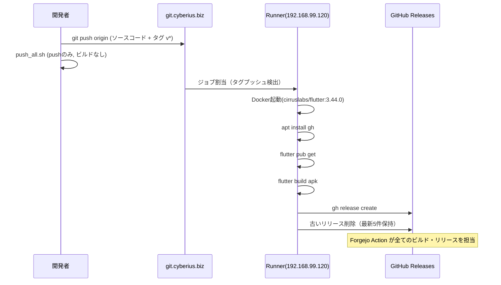

# リリースアーキテクチャ

## 全体像

```
[開発環境]
  push_all.sh v1.x.x
       │
       ├── ① ソースコード + タグ → git.cyberius.biz (Forgejo)
       │                              │
       │                              ├── ② Forgejo Action 発火（タグ検出）
       │                              │        │
       │                              │        ├── ③ ジョブ割当
       │                              │        │
       │                              ▼         ▼
       │                       ┌──────────────┐
       │                       │  Runner       │
       │                       │  192.168.99.120│
       │                       │  (PVE container)│
       │                       │               │
       │                       │  Docker:      │
       │                       │  cirruslabs/  │
       │                       │  flutter:3.44.0│
       │                       │               │
       │                       │  flutter build │
       │                       │  → app-release│
       │                       │     .apk      │
       │                       └───────┬───────┘
       │                               │
       │                               ├── ④ GitHub Release 作成
       │                               │    krasherjoe/h1-core
       │                               │    https://github.com/.../releases/tag/v1.x.x
       │                               │
       │                               └── ⑤ 古いリリース削除（最新5件保持）
       │
       └── ⑥ README → GitHub (gh worktree push)
```

## コンポーネント

### git.cyberius.biz（Forgejo）

- **役割**: ソースコード管理 + Actions トリガー
- **URL**: `ssh://git@git.cyberius.biz/joe/h1-core.git`
- **認証**: SSH (公開鍵)
- **Actions トリガー条件**: タグ `v*` のプッシュ
- **実体**: `www.cyberius.biz:5000` 上のコンテナ（osa ユーザーの環境）
- **リポジトリ設定**: GitHub のミラーとして運用。GitHub Release は Forgejo の GH_TOKEN Secret から gh CLI 経由で作成

### Runner（192.168.99.120 / hostname: forgejo）

- **役割**: Forgejo Action のジョブを実際に実行する
- **OS**: PVE 上のコンテナ
- **ホスト名**: `forgejo`
- **SSH**: `ssh git`（設定: `~/.ssh/config` → `Host git`）
- **場所**: `192.168.99.120:22`（LAN 内）
- **作業ディレクトリ**: `/root/runner/`
- **プロセス**: `forgejo-runner daemon --config /root/runner/config.yml`
- **サービス**: `forgejo-runner.service`（systemd, 自動起動）
- **ログ**: `journalctl -u forgejo-runner -f`

**注意**: このコンテナ内には他プロジェクトの Forgejo も同居している。**触ってはならない。**

### Docker イメージ（ghcr.io/cirruslabs/flutter:3.44.0）

- **ベース**: Ubuntu 24.04
- **Flutter**: 3.44.0（Dart 3.12.0）
- **Android SDK**: 同梱（APK ビルド可能）
- **容量**: 2.28GB（Content）/ 7.08GB（Total）
- **代替**: `ghcr.io/cirruslabs/flutter:3.12.0` もキャッシュ済み（1.36GB）
- **runner 設定**: `config.yml` のラベル指定:

```yaml
labels:
  - ubuntu-latest:docker://ghcr.io/cirruslabs/flutter:3.44.0
```

### GitHub（krasherjoe/h1-core）

- **公開内容**: APK ファイル + README.md のみ
- **Release URL**: `https://github.com/krasherjoe/h1-core/releases`
- **認証**: `GH_TOKEN`（Personal Access Token, repo 権限）
- **Secret 保存場所**: git.cyberius.biz のリポジトリ設定 → Actions Secrets → `GH_TOKEN`

### 開発環境（ローカルマシン）

- **物理**: PVE 上の別コンテナ
- **OS**: Linux
- **ツール**: Flutter SDK, Android SDK, gh CLI, OpenCode
- **リリーススクリプト**: `scripts/push_all.sh`

## リリースフロー詳細

### ローカルリリース（push_all.sh）

```
./scripts/push_all.sh v1.x.x
```

| ステップ | 処理 | 対象 |
|---------|------|------|
| 1/3 | git push origin (ソースコード + タグ) | git.cyberius.biz |
| 2/3 | README 更新 | GitHub main |
| 3/3 | 完了表示 | - |

APK ビルドと GitHub Release 作成は Forgejo Action が自動実行する。ローカルではビルドしない。

### Forgejo Action リリース（自動）

タグ `v*` を git.cyberius.biz にプッシュすると自動起動:

| ステップ | 処理 | 実行環境 |
|---------|------|---------|
| 1 | apt で gh CLI インストール | Docker コンテナ |
| 2 | actions/checkout@v4 | Docker コンテナ |
| 3 | flutter pub get | Docker コンテナ |
| 4 | flutter build apk --release | Docker コンテナ |
| 5 | gh release create (GitHub Release) | Docker コンテナ |
| 6 | 古いリリース削除（最新5件保持） | Docker コンテナ |

**トリガー条件**: `on push tags: 'v*'`

### リリースフロー



## ワークフロー定義

`.forgejo/workflows/build.yml`:

```yaml
name: Build & Release
on:
  push:
    tags:
      - 'v*'

jobs:
  build:
    runs-on: ubuntu-latest
    steps:
      - name: 依存関係インストール
        run: |
          apt-get update -qq
          apt-get install -y -qq ca-certificates curl gnupg gh
          mkdir -p /etc/apt/keyrings
          curl -fsSL https://deb.nodesource.com/gpgkey/nodesource-repo.gpg.key | gpg --dearmor -o /etc/apt/keyrings/nodesource.gpg
          echo "deb [signed-by=/etc/apt/keyrings/nodesource.gpg] https://deb.nodesource.com/node_20.x nodistro main" > /etc/apt/sources.list.d/nodesource.list
          apt-get update -qq
          apt-get install -y -qq nodejs
          node --version

      - uses: actions/checkout@v4

      - run: flutter pub get

      - name: APKビルド
        run: |
          flutter build apk --release --dart-define=APP_VERSION="${{ github.ref_name }}"

      - name: GitHub Release
        env:
          GH_TOKEN: ${{ secrets.GH_TOKEN }}
        run: |
          APK_NAME="h1-core-${{ github.ref_name }}.apk"
          cp build/app/outputs/flutter-apk/app-release.apk "/tmp/$APK_NAME"
          LOG=$(git log --oneline --no-decorate "$(git tag --sort=-creatordate | head -1)"..HEAD 2>/dev/null || true)
          BODY="## ${{ github.ref_name }} 変更点"
          if [ -n "$LOG" ]; then
            BODY="$BODY"$'\n'"$LOG"
          fi
          gh release view "${{ github.ref_name }}" --repo krasherjoe/h1-core &>/dev/null \
            && gh release delete "${{ github.ref_name }}" --repo krasherjoe/h1-core --yes
          gh release create "${{ github.ref_name }}" \
            --repo krasherjoe/h1-core \
            --title "${{ github.ref_name }}" \
            --notes "$BODY" \
            "/tmp/$APK_NAME#$APK_NAME"

      - name: 古いリリース削除（最新5件のみ保持）
        env:
          GH_TOKEN: ${{ secrets.GH_TOKEN }}
        run: |
          gh release list --limit 200 --repo krasherjoe/h1-core --json tagName --jq '.[].tagName' \
            | sort -V \
            | head -n -5 \
            | while read tag; do
                echo "  削除: $tag"
                gh release delete "$tag" --repo krasherjoe/h1-core --yes 2>/dev/null || true
              done
```

## SSH 接続設定

`~/.ssh/config`:

```
host cyb0
  hostname www.cyberius.biz
  port 5000
  user osa

host git.cyberius.biz
  IdentityFile ~/.ssh/id_ed25519
  ProxyJump cyb0
  StrictHostKeyChecking no
  UserKnownHostsFile=/dev/null

host git
  hostname 192.168.99.120
  port 22
  user root
```

| エイリアス | 接続先 | 用途 |
|-----------|--------|------|
| `ssh git.cyberius.biz` | Forgejo (gitサーバー) | git push / pull |
| `ssh git` | Runner コンテナ | メンテナンス・監査 |
| `ssh cyb0` | PVE ホスト | インフラ管理 |

## Runner 管理コマンド

```bash
# 状態確認
systemctl status forgejo-runner

# ログ監視
journalctl -u forgejo-runner -f

# 設定再読込（config.yml 編集後）
systemctl restart forgejo-runner

# 紐付け情報
cat /root/runner/.runner

# ディスク容量
docker system df

# 利用可能な Docker イメージ一覧
docker images
```
